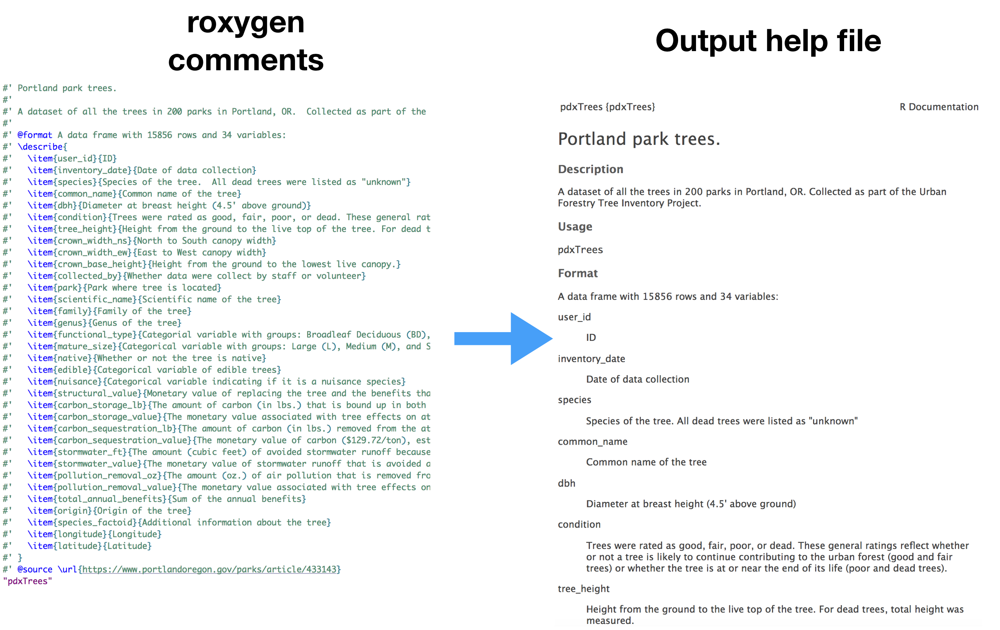

```{r setup, include=FALSE}
knitr::opts_chunk$set(echo = TRUE)
```

**Step 1** Create a `Github` Repository called 'RDatapackage', and clone it to your machine (using `Github Desktop`).  

**Step 2**
+ Create package with `usethis::create_package("~/filepath/RDatapackage")`.

+ Commit your changes to `Github` **BUT**.
    + Only commit the DESCRIPTION and NAMESPACE.
+ Push your changes- can you see them on `Github`?

**Step 3**: Open the `.gitignore` file using a text editor of choice, and add the following lines:

- `.gitignore`
- `.Rbuildignore`


**Step 4**: Add the raw data and transform it into the clean form I want to share in the package.

- Run the function `usethis::use_data_raw()` to create a `data-raw` folder in the R project and the file `DATASET.R`.
- Put the raw data files in the `data-raw` folder.
- Use the file `DATASET.R` to load and wrangle the raw data.
- At the bottom of the wrangling file, include the following code to create a clean `.Rda` file:

```{r, eval = FALSE}
# Swap seattle_bike for the name of your data
usethis::use_data(seattle_bike, overwrite = TRUE)
```

- Run the code in `DATASET.R` to create a new folder called `data` that contains the cleaned data file.


**Step 5**: Create the documentation/help file for the data.

-  Run `usethis::use_r("insert_data_name")` to create a script file.
- Add [`roxygen`](https://cran.r-project.org/web/packages/roxygen2/index.html) comments that document the dataset. 
    + See the [Object Documentation Chapter](http://r-pkgs.had.co.nz/man.html) of [R packages](http://r-pkgs.had.co.nz/).
- Run `devtools::document()`, which creates the `man` folder and an `Rd` help file.
- Run `?insert_data_name` in the console to view the help file.  

```{r, out.width="100%", echo=FALSE, eval = TRUE}

```

- Notice that you need to include the dataset name as a string in the bottom of the R script.  If you forget this, the help file for that dataset won't be created!


**Step 6**: Edit the [DESCRIPTION file](http://r-pkgs.had.co.nz/description.html) and consider creating a Readme file.  The code `usethis::use_readme_md(open = interactive())` generates a skeleton Readme file.  

**Step 7**: Delete any extraneous files or list them in .Rbuildignore.

**Step 8**: Run checks with `devtools::check(document = FALSE)` to make sure the package compiles without errors or warnings.  Run `devtools::load_all()` to simulates the process of building, installing, and attaching the package if you want to check its contain.

- Fix any errors or warnings.  (Note: it will still compile under warnings.)

**Step 9**: Try installing the package with `devtools::install()`.

**Step 10/Always**: Push the changes to the GitHub repository. 

